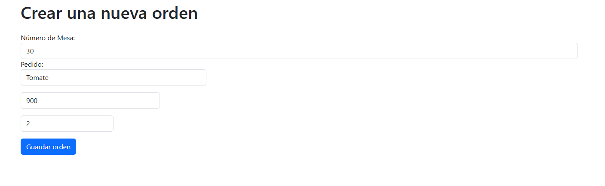
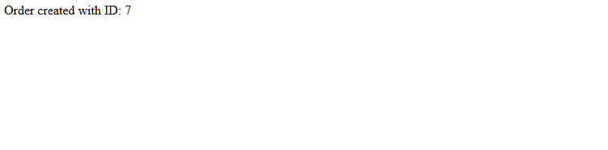
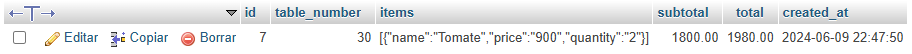

1. Descripcion del proyecto: 

Desarrollar un sistema de pedidos para un restaurante utilizando Node.js, Express.js y MySQL. El sistema permitirá ingresar los pedidos de los clientes, calcular el subtotal, el total incluyendo una propina del 10%, y registrar el número de mesa. Además, se deberán aplicar estilos a la interfaz y documentar adecuadamente cada archivo JavaScript.

2. Instrucciones para configurar y ejecutar el proyecto:

Primero que nada debe tener instalado NodeJS y tenerlo configurado en las variables de entorno con el fin de poder utilizar la terminal para ejecutar comandos nodejs y ademas debe instalar XAMPP para poder almacenar datos en una base de datos, en este caso sera una base de datos relacional en el lenguaje MySQL. Luego de abrir XAMPP, debe iniciar los servicios de APACHE y MYSQL.

Segundo, debe abrir la terminal y desde aqui, en el caso de que desee ejecutar el proyecto como desarrollador, debera digitar el comando "npm run dev" (sin comillas) o caso de que no quiera ejecutar el proyecto como desarrollador basta con ingresar el comando "node app.js" (sin comillas) en la terminal. Previo a este paso, debe encontrar el directorio del proyecto con el comando "cd Directorio/restaurant-orders/".

Por ultimo, desde su cliente debe dirigirse a la siguiente ruta: localhost:3000/orders/new para poder ingresar un nuevo pedido, luego ingrese los datos solicitados y presione el boton guardar, cuando haya clickeado en guardar el formulario se enviara como objetos json al servidor para que sean procesados y finalmente se guarden en la base de datos

3. Capturas de pantalla de la interfaz de usuario:

